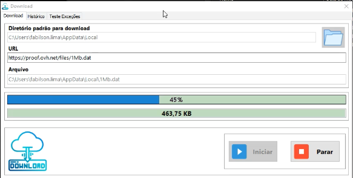
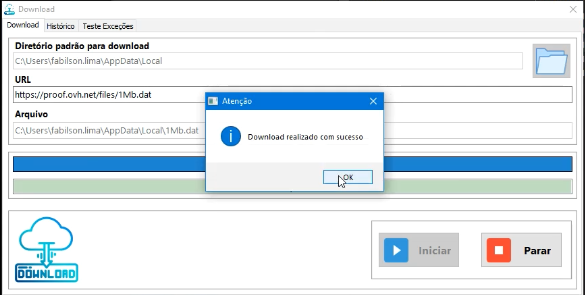
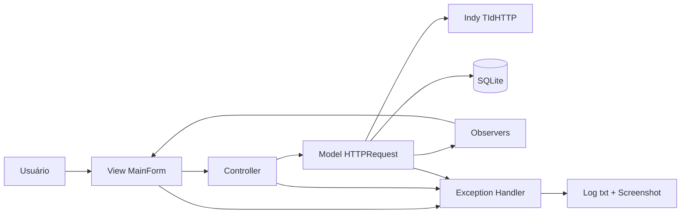

# Download (Delphi)

Aplicação desktop em Delphi para download de arquivos via URL, com execução em background, histórico em SQLite e tratamento centralizado de exceções.


## Visão Geral

Este projeto foi construído para demonstrar uma aplicação desktop Delphi com:

- Interface VCL desacoplada em camadas.
- Download HTTP/HTTPS com atualização de progresso.
- Persistência de histórico em SQLite.
- Log técnico de exceções com captura de tela.

## Demo

- Vídeo: [demo.mp4](Demo/demo.mp4)

## Screenshots




## Arquitetura

### Camadas

- `View`: eventos de tela e atualização visual.
- `Controller`: orquestração entre interface e regras de negócio.
- `Model`: HTTP request, entidades de download e persistência.
- `Exception`: captura global de erros e escrita de logs.
- `Utils` e `Types`: utilitários e tipos compartilhados.

### Diagrama (alto nível)



## Fluxo da Aplicação

1. Usuário informa URL e diretório de destino.
2. `Controller` inicia o processo de download no `Model`.
3. `Model` executa download em task/thread e notifica progresso (Observer).
4. `View` atualiza barra de progresso e tamanho atual do arquivo.
5. Em sucesso, grava fim do download no SQLite; em erro, registra exceção.

## Stack Técnica

- Delphi VCL (`.dproj`)
- Indy (`TIdHTTP`, SSL handler)
- SQLite (FireDAC)
- Padrões: MVC, Observer, princípios SOLID

## Requisitos

- Windows
- Delphi com suporte ao projeto `Download.dproj`
- Dependências de runtime:
  - `bin/libeay32.dll`
  - `bin/ssleay32.dll`
  - `bin/database/sqlite3.dll`

## Quick Start

```bash
git clone https://github.com/fabilson-ssa/Download.git
```

1. Abrir `Download.dproj` no Delphi.
2. Compilar (`Shift + F9`).
3. Executar a aplicação.
4. Testar download com uma URL pública.

## Estrutura do Projeto

```text
Controller/   # Interfaces e orquestração
Model/        # Regras de negócio, HTTP e banco
View/         # Formulário principal e UI
Exception/    # Tratamento global de exceções
Types/        # Tipos e enums
Utils/        # Helpers
Demo/         # Arquivo de demonstração
bin/          # Executável, DLLs, banco e logs
```

## Persistência e Observabilidade

- Banco: `bin/database/database.db`
- Tabela principal: `logdownload`
- Log de exceções: `bin/log/log.txt`
- Capturas de erro: `bin/log/screenshots/`

## Limitações Atuais

- Sem testes automatizados.
- Fluxo atual orientado a um download por vez.
- Validação de disponibilidade depende de `HEAD` e `Content-Length`.

## Roadmap

- Suporte a downloads simultâneos.
- Retentativas automáticas para falhas de rede.
- Suíte de testes unitários para `Model` e `Controller`.
- Definição de licença (ex.: MIT).

## Contribuições

Issues e pull requests são bem-vindos.
